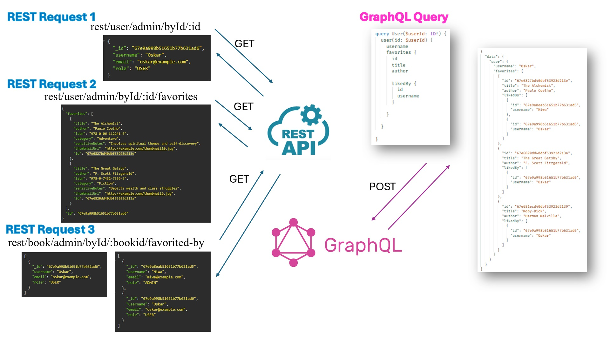

# Book Management_GraphQL API & REST API_Backend

## Comparison Between GraphQL and REST: Implementation and Observations

| No. | Aspect | GraphQL | REST |
|-----|--------|---------|------|
| 1 | Client-side Data Control | The client can request only the fields it needs, reducing over-fetching. Example: request only `thumbnailUrl` when needed. | The response is static — over-fetching is more likely. Images may always be included in the response. |
| 2 | Access Control & Sensitive Data | Poor schema or permission design can lead to accidental exposure of sensitive data, e.g., `sensitiveNotes`. | Only specific endpoints like `GET /rest/book/admin/all` are created for sensitive data → lower risk. |
| 3 | Error Handling | Returns detailed error messages that may reveal internal information. | Simpler error messages; lower risk of exposing server information. |
| 4 | Caching & Performance | Flexible queries make HTTP caching harder. Requires client-side caching (e.g., Apollo). | HTTP caching (e.g., Cache-Control) works well; easier to cache static resources. |

### Observations
- GraphQL is great for flexible data fetching but requires careful caching and permission handling.  
- REST is more straightforward and easier to cache, but may lead to over-fetching.  

## 4.2.1 Client-side Data Control

This section illustrates the difference between REST and GraphQL in terms of client-side data fetching in a book management application.

### REST
- Requires multiple separate API requests to fetch different resources:
  1. Get all attributes for a specific user (`GET rest/user/admin/byId/:id`)
  2. Get all favorite books of that user (`GET rest/user/admin/byId/:id/favorites`)
  3. For each book, get all users who favorited it (`GET rest/book/admin/byId/:bookid/favorited-by`)
- Issues:
  - **Under-fetching**: a single request does not provide all necessary data
  - **Over-fetching**: responses may include unnecessary data (e.g., image URLs), impacting performance, especially on mobile networks

### GraphQL
- Allows a single request to specify exactly what data is needed:
  - User ID and username
  - Favorite books’ ID, title, and author
  - IDs and usernames of other users who favorited the same books
- Benefits:
  - Efficient and minimal data transfer
  - Better control for the client
  - Avoids unnecessary data and improves performance in bandwidth-constrained environments

### Summary
- REST: multiple requests per resource → over-fetching and under-fetching possible
- GraphQL: single flexible request → precise data retrieval and improved client-side control


*Figure 1: Example of client-side data fetching using REST vs GraphQL*

## How to start

Follow these steps to set up and run the frontend application with GraphQL and Apollo Client:

---

### 1. Set up Environment Variables

Create a `.env` file in the project root with the following content:
```bash
MONGODB_URI = XXX
JWT_SECRET = XXX
NODE_ENV = production # or development
```
- **MONGODB_URI**: MongoDB connection string  
- **JWT_SECRET**: Secret key used for JWT authentication  
- **NODE_ENV**: `production` or `development` environment  

> **Note:** Replace `XXX` with your actual credentials. Never commit secrets to GitHub.

---

### 2. Install Dependencies
```bash
npm install   nodemon server.js

```

